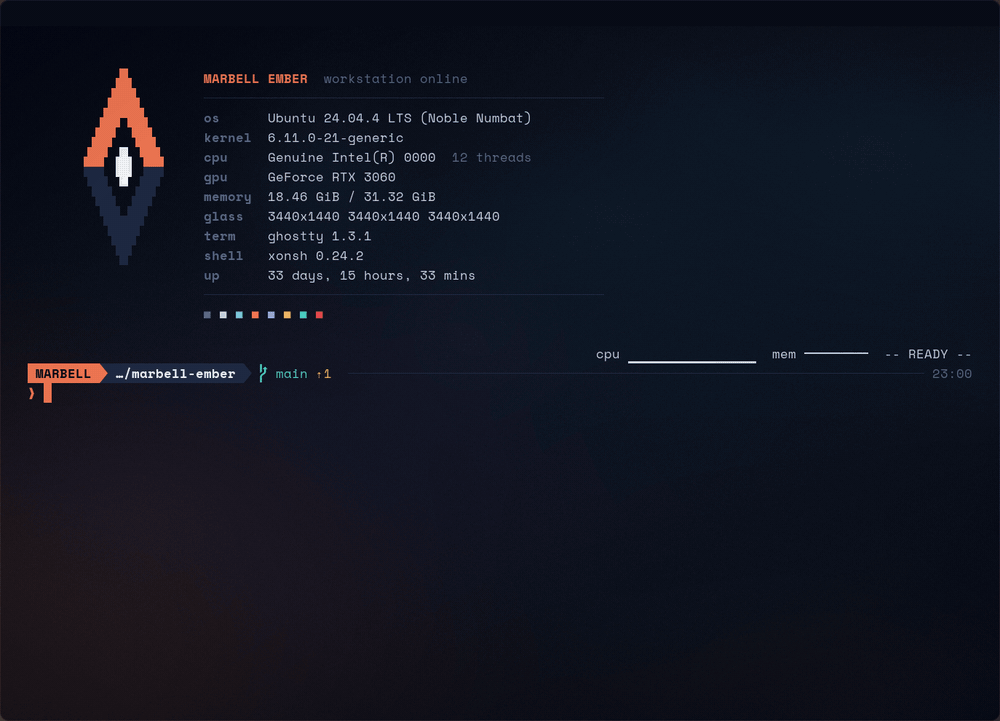
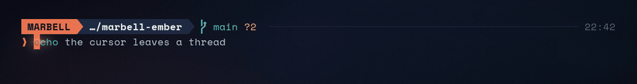
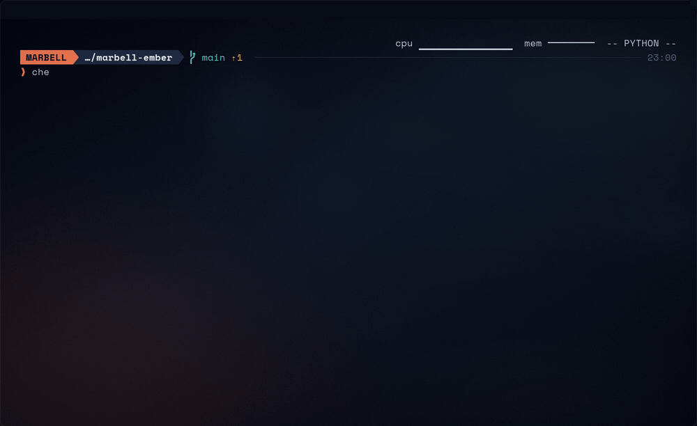
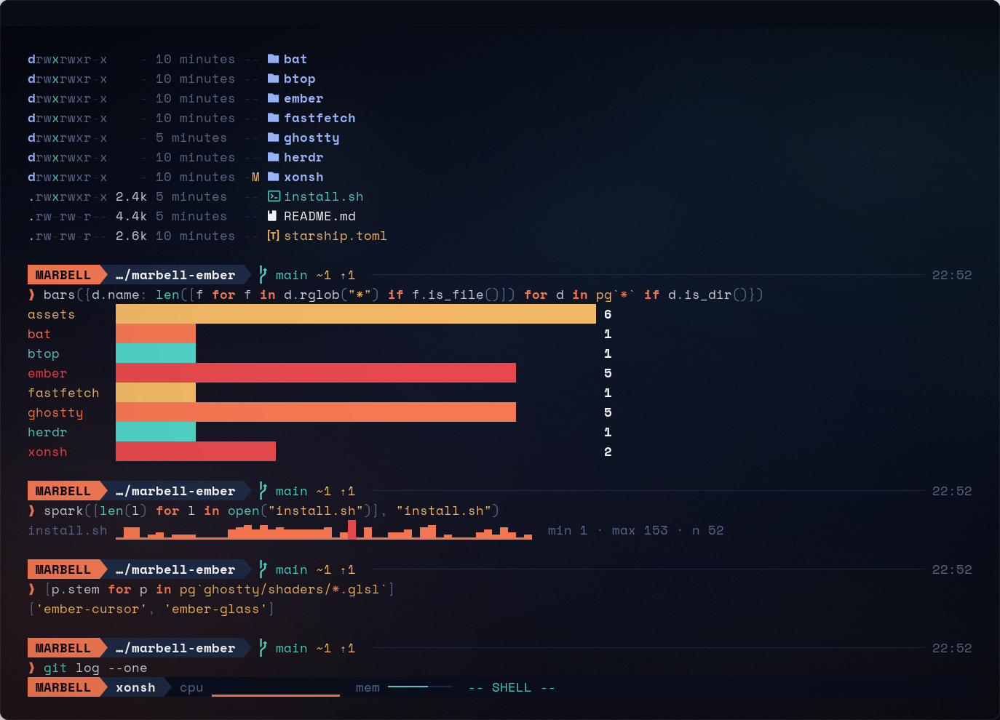
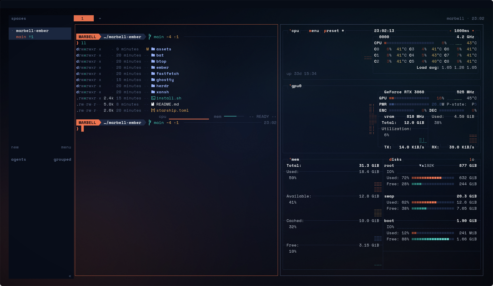
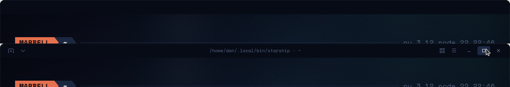
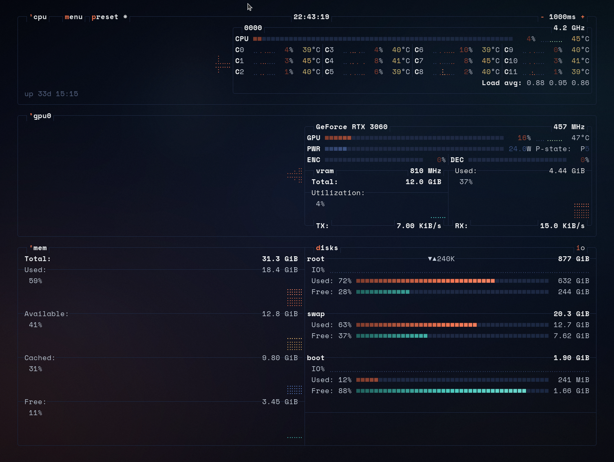

# Marbell Ember

A terminal that does not look like anyone else's: Ghostty with custom shaders, xonsh, a bespoke Starship prompt, and herdr, all in one palette.



It started as a console drawn for a film and was rebuilt as a real terminal: navy glass, one coral accent, and the rule that coral is the only thing that glows.

## What is in it

**Shaders.** Two GLSL passes run on the whole terminal. `ember-glass.glsl` gives coral text a phosphor glow (the accent is read from palette slot 5, so it follows the theme) and sweeps a line of light down the window when it takes focus. `ember-cursor.glsl` makes the cursor leave a thread from where it was to where it lands.



**Python at the prompt.** The shell is xonsh, so a line is either a command or Python, and the two mix: `$(...)` captures a command's output into a Python value, `@(...)` drops a Python value into a command, and `` pg`*.glsl` `` is a glob that returns `Path` objects. The status line at the bottom flips between `-- SHELL --` and `-- PYTHON --` as you type.



`ember.py` adds charts that draw on the character grid: `bars`, `spark`, `gauge`, `panel`, `table`. The status line also carries a CPU sparkline and a memory meter.



**Workspaces.** herdr is themed to match: coral active tab and focus border, panes open xonsh.



**Hidden window controls.** The title bar is a blank strip in the terminal's own colour. The buttons fade in only while the mouse is over it.



**Tools.** eza, bat, fzf, delta, fastfetch and btop all use the same colours.



## Palette

| | Hex | Used for |
|---|---|---|
| glass | `#070B16` | background |
| line | `#1E2A44` | borders, rules, inactive meter |
| dim | `#5B6B8C` | labels, comments |
| text | `#C9D3E3` | body |
| bright | `#F4F7FB` | bold, titles |
| coral | `#F47853` | prompt, cursor, focus (ANSI magenta slot) |
| teal | `#4FD1C5` | added, pass |
| amber | `#F2B866` | warnings, strings |
| red | `#E5484D` | removed, errors |

## Requirements

Built and tested on Ubuntu 24.04, X11, GNOME, NVIDIA, in October 2026.

| Tool | Version used |
|---|---|
| [Ghostty](https://ghostty.org) | 1.3.1 (shader colour and focus uniforms need 1.3) |
| [xonsh](https://xon.sh) | 0.24.2, with `xontrib-term-integrations` |
| [Starship](https://starship.rs) | 1.26 |
| [herdr](https://herdr.dev) | 0.9.3 (optional) |
| fastfetch, eza, bat, btop, fzf, zoxide, delta, ripgrep | current releases |

xonsh in its own environment:

```bash
uv tool install 'xonsh[full]' --with xontrib-term-integrations
```

The font is Space Mono; the installer downloads it if it is missing. Icons come from Ghostty's built-in Nerd Font fallback.

## Install

```bash
git clone https://github.com/vantasnerdan/marbell-ember
cd marbell-ember
./install.sh
```

The installer copies configs into `~/.config`, keeps a numbered backup of every file it replaces, and lists any tools that are missing. It installs no packages and does not change your login shell.

Ghostty starts xonsh directly, so nothing from `~/.bashrc` is inherited. Put your PATH entries and exports in `~/.config/xonsh/local.xsh`; the installer creates it from `xonsh/local.xsh.example`.

## Layout

```
ghostty/   config.ghostty, ember.css (hover-only title bar), themes/Marbell Ember, shaders/
ember/     ember.py (charts + status line), plate.png, make_plate.py, logo.txt, delta.gitconfig
xonsh/     rc.xsh, local.xsh.example
starship.toml
herdr/     config.toml
fastfetch/ config.jsonc
bat/ btop/ tool themes
```

## Knobs

- The word in the prompt block: `$EMBER_CALLSIGN` (default `MARBELL`).
- Shader strength: the constants at the top of each `.glsl` file.
- A different background plate: `python3 ember/make_plate.py plate.png <seed>` (needs numpy and Pillow).
- The title bar is an invisible strip at the top (`ghostty/ember.css`). Hover it and the window buttons fade in; drag it to move, double-click to maximise, drag the edges to resize. `ctrl+shift+d` removes it entirely.
- `ctrl+r` searches history and `ctrl+t` picks files, both through fzf.

## Notes

- The terminal is opaque on purpose. A see-through terminal shows whatever is behind it on a screen share. GNOME has no compositor blur, so the "glass" is a baked plate.
- The prompt shows no user or host name, and the boot card shows no hostname or IP.
- btop's release binaries have no GPU support; build it from source for the GPU panel.
- Starship has no transient prompt for xonsh.
