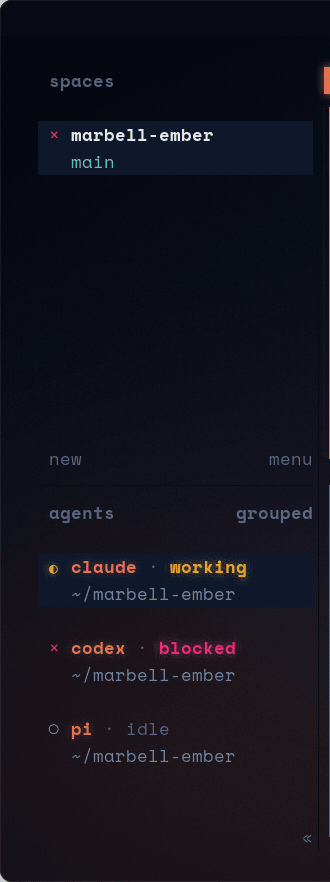
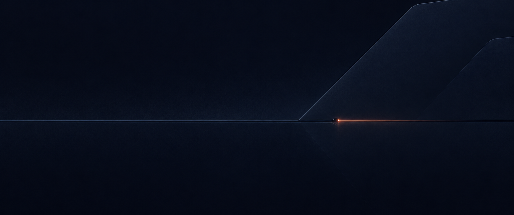

# Marbell Ember

A terminal that does not look like anyone else's: Ghostty with custom shaders, xonsh, a bespoke Starship prompt, and herdr, all in one palette.


It started as a console drawn for a film and was rebuilt as a real terminal: navy glass, one coral accent, and the rule that coral is the only thing that glows.

## What is in it

**Shaders.** Two GLSL passes run on the whole terminal. `ember-glass.glsl` gives coral shapes a faint halo (the accent is read from palette slot 5, so it follows the theme), pulses the agent-state signal colours, and sweeps a line of light down the window when it takes focus. `ember-cursor.glsl` makes the cursor leave a thread from where it was to where it lands.


**Python at the prompt.** The shell is xonsh, so a line is either a command or Python, and the two mix: `$(...)` captures a command's output into a Python value, `@(...)` drops a Python value into a command, and `` pg`*.glsl` `` is a glob that returns `Path` objects. A readout at the top right of the live prompt flips between `-- SHELL --` and `-- PYTHON --` as you type.


`ember.py` adds charts that draw on the character grid: `bars`, `spark`, `gauge`, `panel`, `table`. The same readout carries a CPU sparkline and a memory meter, and clears itself once a line is run.


**Workspaces.** herdr is themed to match: coral active tab and focus border, a transparent sidebar, panes open xonsh. Agent state is drawn in two signal colours that appear nowhere else in the theme, and the glass shader looks for exactly those colours: `working` breathes amber, `blocked` blinks pink-red. It is all config; herdr itself is untouched.




**Hidden window controls.** The title bar is a blank strip in the terminal's own colour. The buttons fade in only while the mouse is over it.


**Tools.** eza, bat, fzf, delta, fastfetch and btop all use the same colours.


## Palette

| | Hex | Used for |
|---|---|---|
| glass | `#070B16` | background |
| line | `#1E2A44` | borders, rules, inactive meter |
| dim | `#5B6B8C` | labels, comments |
| text | `#C9D3E3` | body |
| bright | `#F4F7FB` | bold, titles |
| coral | `#F47853` | prompt, cursor, focus (ANSI magenta slot) |
| teal | `#4FD1C5` | added, pass |
| amber | `#F2B866` | warnings, strings |
| red | `#E5484D` | removed, errors |

## Requirements

Originally built on Ubuntu 24.04 with GNOME, X11 and NVIDIA. Also tested on
Ubuntu 26.04.1 with GNOME Shell 50.1, Wayland, GTK 4.22.4, libadwaita 1.9.1
and an NVIDIA RTX 3060 (driver 580.178.04), at 3440×1440/60 Hz. X11 is not required.

| Tool | Version used |
|---|---|
| [Ghostty](https://ghostty.org) | 1.3.1 (shader colour and focus uniforms need 1.3) |
| [xonsh](https://xon.sh) | 0.24.2, with `xontrib-term-integrations` |
| [Starship](https://starship.rs) | 1.26 |
| [herdr](https://herdr.dev) | 0.9.3 (optional) |
| fastfetch, eza, bat, btop, fzf, zoxide, delta, ripgrep | current releases |

xonsh in its own environment:

```bash
uv tool install 'xonsh[full]' --with xontrib-term-integrations
```

The font is Space Mono; the installer downloads it if it is missing. Icons come from Ghostty's built-in Nerd Font fallback.

On NVIDIA, `__GL_YIELD=USLEEP` lets the driver sleep while Ghostty waits in
`glFinish()`, reducing measured main-thread CPU from **40.47% to 7.67%** of one
core on the setup above, with all effects retained.
See [NVIDIA's yield setting](https://download.nvidia.com/XFree86/Linux-x86_64/580.178.04/README/openglenvvariables.html)
and [Ghostty 1.3.1's frame completion](https://github.com/ghostty-org/ghostty/blob/v1.3.1/src/renderer/opengl/Frame.zig).

The installer sets this in a systemd user drop-in for
`app-com.mitchellh.ghostty.service` and reloads unit definitions without restarting
Ghostty. It takes effect on the service's next start. For shell launches, or
packages without that unit, use:

```bash
env __GL_YIELD=USLEEP ghostty
```

## Install

```bash
git clone https://github.com/vantasnerdan/marbell-ember
cd marbell-ember
./install.sh
```

The installer copies configs and the Ghostty systemd user drop-in into `~/.config`
(respecting `XDG_CONFIG_HOME`), keeps a numbered backup of every file it replaces,
and lists any tools that are missing. It leaves the packaged launcher and unit
alone, installs no packages and does not change your login shell.

Ghostty starts xonsh directly, so nothing from `~/.bashrc` is inherited. Put your PATH entries and exports in `~/.config/xonsh/local.xsh`; the installer creates it from `xonsh/local.xsh.example`.

## Coming from bash

xonsh is not bash. Agents are unaffected: `$SHELL` stays `/bin/bash`, so Claude Code, Codex and anything else that shells out keeps using bash, and herdr still detects agents started from an xonsh pane. What changes is what a person types or pastes at the prompt:

| bash | here |
|---|---|
| `export FOO=bar`, `unset FOO` | work (shimmed in `rc.xsh`) |
| `FOO=bar cmd` | `$FOO="bar" cmd` |
| `${HOME}` | `$HOME` |
| `echo $?` | the prompt shows `✗ <code>`; in code, `__xonsh__.history.rtns[-1]` |
| `` `cmd` `` | `$(cmd)` |
| `for i in 1 2 3; do ...; done` | a Python `for` loop, or `bash -c '...'` |
| `cat <<EOF` heredocs | `bash -c '...'`, or a Python string |
| `source script.sh`, `source venv/bin/activate` | `source-bash script.sh`; for virtualenvs, `xontrib load vox` then `vox activate` |
| pasting several lines | runs after a second Enter |

`&&`, `||`, `;`, pipes, redirects, `2>&1`, `&`, Ctrl-C, Ctrl-Z / `fg`, `$(...)`, `~`, tab completion and full-screen programs behave as in bash. `ls` is eza, but falls back to real `ls` for flag clusters eza reads differently, such as `ls -ltr`.

Every optional tool is guarded. On a machine with only xonsh installed the same `rc.xsh` still loads: a native prompt in the Ember colours replaces Starship, `ls` is plain `ls`, and Ctrl-R is xonsh's built-in search.

## Desktop

The optional Ubuntu 26.04 desktop theme carries Ember into window bars, a named GTK3/GTK4 theme and libadwaita user CSS, GNOME Shell through User Themes, and folder icons. It also sets the wallpaper, dock, Space Mono fonts and GNOME Terminal/Ptyxis profiles, adds a Nerd Font fallback for Space Mono, and supplies a GTK override for the Brave snap. Teal navigation, amber headings and blue file details sit against navy; coral marks focus and selection.

GTK/Shell theme bases and folder icons are generated from your installed Yaru at install time. Derived Ubuntu themes are not shipped. The repo supplies the builders, CSS overrides and five ultrawide wallpapers.



With the [desktop requirements](gnome/USAGE.md#requirements) installed, apply from the checkout:

```bash
./gnome/apply.sh
```

Restore the saved settings and files, including Shell and icons:

```bash
./gnome/revert.sh
```

Reopen applications to load their CSS. On first installation, User Themes and existing XWayland title bars take effect at the next login. The scripts do not restart the desktop, change the login screen or boot splash, or add blur or animation. See [desktop usage](gnome/USAGE.md) for dependencies, backups, browser setup and limits.

## Layout

```
ghostty/   config.ghostty, ember.css (hover-only title bar), themes/Marbell Ember, shaders/
ember/     ember.py (charts + live readout), plate.png, make_plate.py, logo.txt, delta.gitconfig
xonsh/     rc.xsh, local.xsh.example
starship.toml
herdr/     config.toml
fastfetch/ config.jsonc
bat/ btop/ tool themes
gnome/     desktop builders, CSS, wallpapers, profiles, apply/revert scripts
```

## Knobs

- The word in the prompt block: `$EMBER_CALLSIGN` (default `MARBELL`).
- Shader strength: the constants at the top of each `.glsl` file.
- A different background plate: `python3 ember/make_plate.py plate.png <seed>` (needs numpy and Pillow).
- The title bar is an invisible strip at the top (`ghostty/ember.css`). Hover it and the window buttons fade in; drag it to move, double-click to maximise, drag the edges to resize. `ctrl+shift+d` removes it entirely.
- `ctrl+r` searches history and `ctrl+t` picks files, both through fzf.
- xonsh keeps its own history (SQLite under `~/.local/share/xonsh/`); it does not read `~/.bash_history`.

## Notes

- The terminal is opaque on purpose. A see-through terminal shows whatever is behind it on a screen share. GNOME has no compositor blur, so the "glass" is a baked plate.
- The prompt shows no user or host name, and the boot card shows no hostname or IP.
- btop's release binaries have no GPU support; build it from source for the GPU panel.
- Starship has no transient prompt for xonsh.
